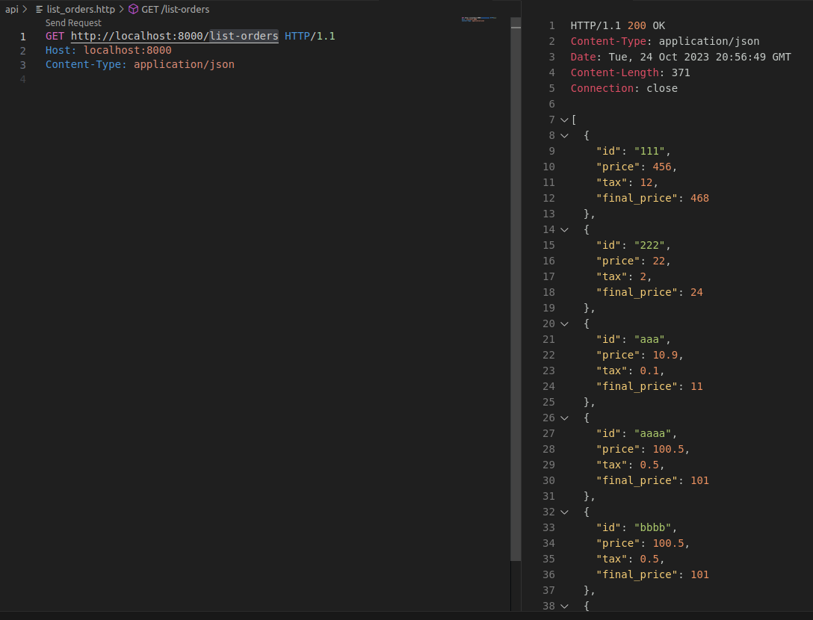
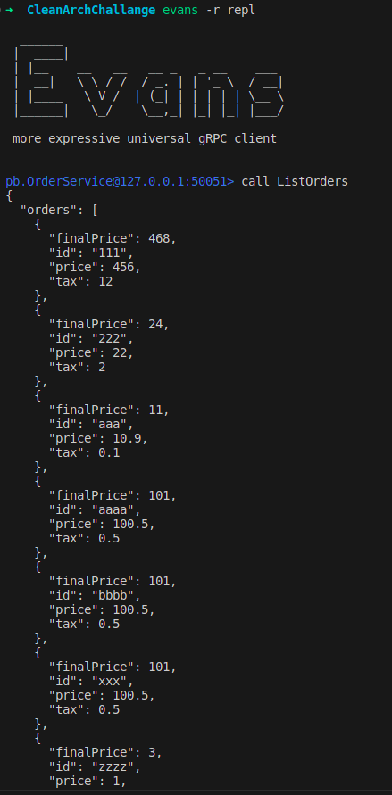
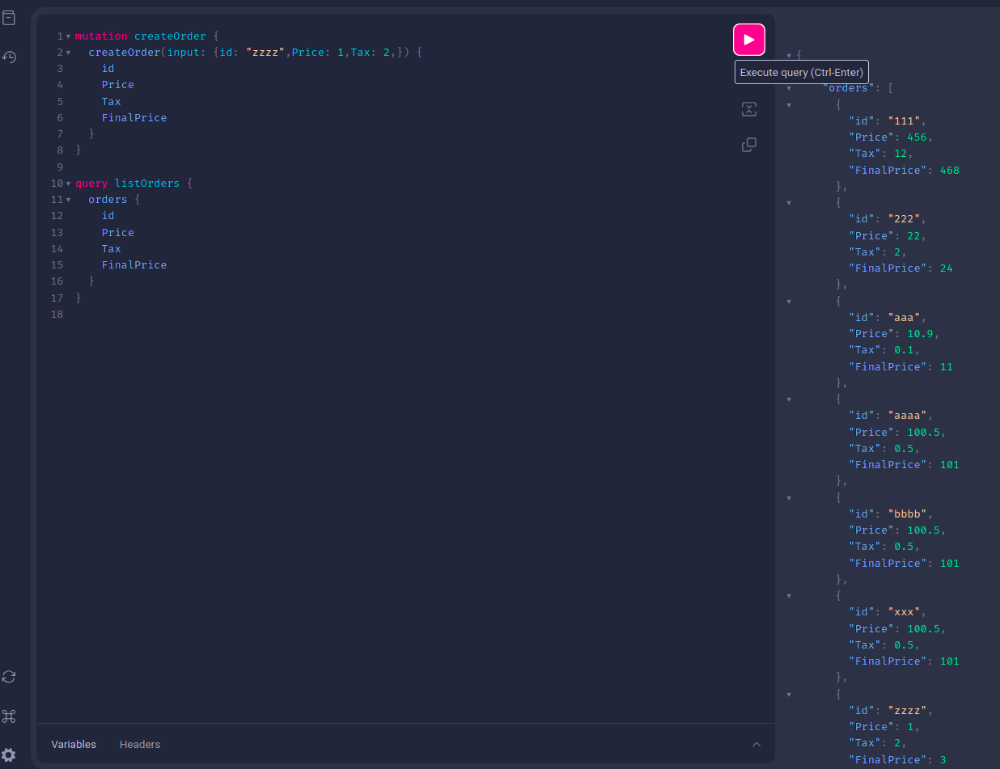
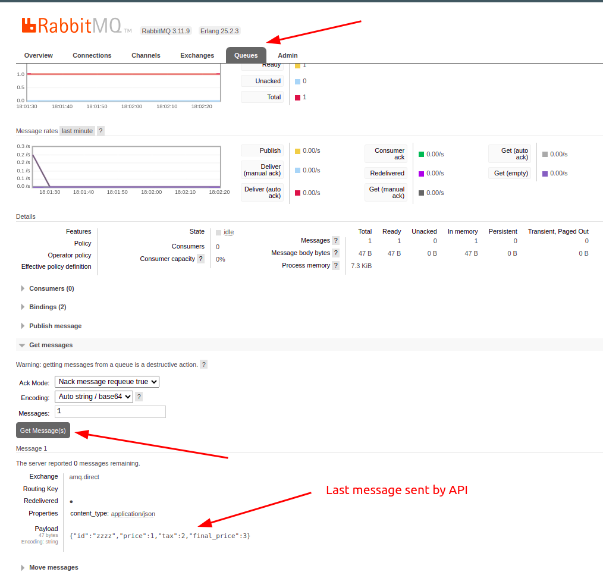

# Clean Architecture 

This little API follows the requirements of the task suggested by `FullCycle` in the `GoExpert` course.

The task is:

```
Olá devs!

Agora é a hora de botar a mão na massa. Pra este desafio, você precisará criar o usecase de listagem das orders.

Esta listagem precisa ser feita com:

- Endpoint REST (GET /order)

- Service ListOrders com GRPC

- Query ListOrders GraphQL

Não esqueça de criar as migrações necessárias e o arquivo api.http com a request para criar e listar as orders.
```

---

## Requirements
* You need to have installed locally:
  * Golang (version >= 1.19)
  * docker-compose (version >= 1.29.2)
  * [gRPC](https://grpc.io/docs/languages/go/quickstart/) (version >= 1.2)
  * [Evans CLI](https://github.com/ktr0731/evans) 
---


## Run the API

1) Clone/download the repository to a local folder;

2) Via terminal(command line), access the cloned repository folder;

3) Run this command in the source folder to start the MySql database and the Rabbit messager:
    * ``` docker-compose up -d ```

    **OBS**: The database already upload the table and a record in the table 

4) Access the folder `cmd/ordersystem` and start the API:
    * ``` cd cmd/ordersystem/ ```
    * ``` go run . ``` OR ``` go run main.go wire_gen.go ```

---

## Test the API outputs

### Through endpoint REST (GET /order-list)
* Just access the following endpoint or run the `list_orders.http` file in the folder `/api`:
    * ``` http://localhost:8000/list-orders ```

    

### Through gRPC
* Access the Evans CLI and call the  the records using the `ListOrders` method
    * ``` evans -r repl ``` 
        * ``` call ListOrders ``` 

    

### Through GraphQl
* Access the following endpoint and write the next query to see the records
    * ``` http://localhost:8080 ```
        ```graphql
        query listOrders {
            orders {
                id
                Price
                Tax
                FinalPrice
            }
        }
        ```

    

### Through RabbitMq
* Access the follwing endpoint, put the login/password (guest/guest), access the Queues tab and click in the `orders` queue. In the botton `Get Messages(s)` you can literally get the last message sent by API.
    * ``` http://localhost:15672 ```

    